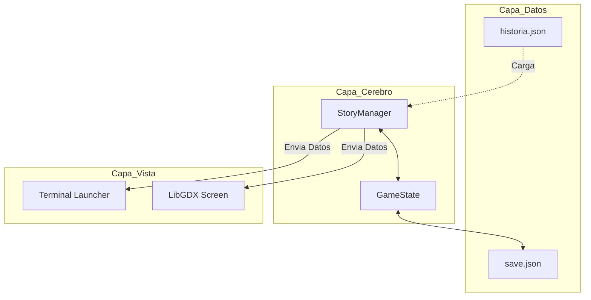
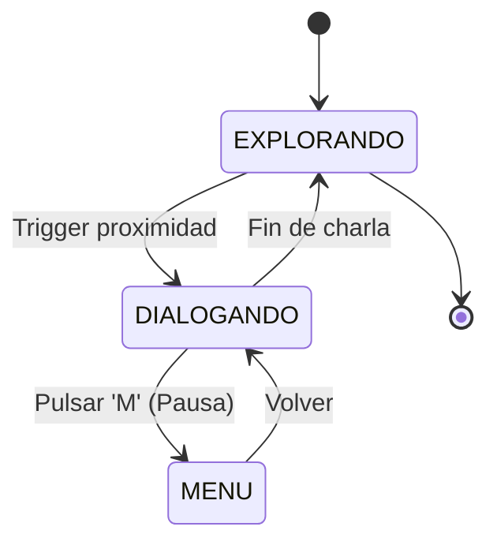
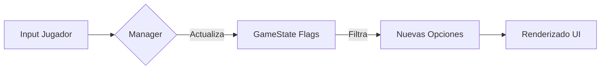

# INTENTIA

> *"Juzgar si la vida vale o no vale la pena vivir es responder a la pregunta fundamental de la filosofía. Considero que el sentido de la vida es la más apremiante de las cuestiones."* — Albert Camus

## Concepto Narrativo

No es solo un juego; **Intentia** es una exploración interactiva sobre el **absurdo** y la **belleza** de la existencia humana. El proyecto invita al jugador a sumergirse en un viaje a través de los ojos de un niño, enfrentándose al asombro y a la duda con la misma curiosidad, en un mundo donde el sentido no se encuentra, sino que se habita.

Esta obra se desarrolla como un **"juego dentro del juego"** donde la realidad es un lienzo neutro y la mirada el pincel. A través del legado del abuelo, el jugador descubre que la narrativa tiene el poder de transformar vapores erráticos en leyendas de dragones, habitando un diálogo entre la filosofía y la ironía que convierte lo cotidiano en una oportunidad para trascender su propia visión del mundo.

Se nutre de influencias que van desde la complejidad de *Don Quijote de la Mancha* hasta el *Mito de Sísifo*, el espíritu de descubrimiento y la curiosidad existencial de ***Outer Wilds***, el peso de la consecuencia narrativa de ***Undertale***, y el humor cínico de obras como *Bojack Horseman* o *Rick y Morty*. Es un viaje centrado en el poder de la mirada y el peso de lo invisible, una experiencia diseñada para nutrir al jugador con la capacidad de encontrar belleza incluso en el corazón del absurdo.

**el arte de ver formas en las nubes.**

---

## Especificacion del Motor y Arquitectura

El motor de Intentia se basa en el desacoplamiento total entre la logica narrativa y la representacion grafica, permitiendo una escalabilidad modular completa.

### 1. Arquitectura de Capas (MVC+)
El sistema separa los datos (JSON), la lógica de gestión avanzada (`StoryManager`), el estado persistente (`GameState`) y las evaluaciones de progresión (`TrialEvaluation`).



### 2. Maquina de Estados de Navegacion
El flujo del usuario se controla mediante estados finitos que determinan la entrada y salida de datos.



### 3. Ciclo de Vida del Dato Narrativo
Como una decision del jugador se convierte en una consecuencia persistente.



---

## Funcionamiento del Sistema

El "corazón" técnico es el `StoryManager`, que actúa como un intérprete de datos (**Data-Driven**). A diferencia de los sistemas lineales, el manager de Intentia procesa la selección de opciones de forma atómica para rastrear puntuaciones y desencadenar eventos.

Gracias a este enfoque, es posible:
*   **Gestión por Selección:** El motor identifica exactamente qué opción se ha pulsado, permitiendo que varios caminos lleven al mismo sitio pero con consecuencias (o puntos) distintos.
*   **Evaluación de Pruebas (Trials):** El sistema puede sumar puntos dinámicamente y comparar el rendimiento del jugador contra un umbral (`threshold`) para decidir el destino de la historia.
*   **Modularidad Total:** Se pueden añadir nuevos capítulos o mecánicas de examen sin modificar una sola línea de código Java.

---

## Persistencia y Gestión de Objetos

El sistema utiliza un modelo de **Flags** para convertir las decisiones volátiles en consecuencias permanentes:

*   **Inventario de Conceptos:** Los objetos no son solo items, son "etiquetas" en el `GameState`. Si posees la `llave_del_abuelo`, el sistema la reconoce y habilita caminos antes invisibles.
*   **Filtros de Narrativa:** Las opciones de diálogo (`DialogOption`) utilizan el campo `requiredFlag` para aparecer o desaparecer dinámicamente según el estado del jugador.
*   **Exámenes de Intención (Trials):** El sistema soporta evaluaciones complejas donde el jugador acumula puntos (`scoreValue`) a través de varios nodos. Al final de la secuencia, un nodo de evaluación compara el porcentaje de acierto y bifurca la historia.
*   **Memoria del Mundo (`save.json`):** El `SaveSystem` garantiza que la realidad no se reinicie al cerrar el juego. Cada avance en la historia activa un **auto-guardado** que congela el estado de los objetos y el nodo actual.

---

## El Espacio Físico: Integración con Tiled

La transición del texto al mundo visual se realiza mediante la interpretación de metadatos en los mapas `.tmx`:

*   **Triggers Invisibles:** Capas de objetos con rectángulos que contienen propiedades `nodeId`. Al colisionar, la física se detiene y la narrativa toma el control.
*   **Eventos de Persistencia:** Ciertos objetos en el mapa solo aparecerán si una "Flag" específica está activa en el `GameState`, permitiendo que el mundo cambie físicamente según tus descubrimientos.

---

## 🗺️ Hoja de Ruta (Roadmap)

El viaje de **Intentia** se divide en hitos de evolución técnica:

1.  **[x] Fase de Abstracción:** Lógica de diálogos, sistema de flags y motor de estados (Terminal).
2.  **[x] Fase de Memoria:** Persistencia JSON y auto-guardado funcional.
3.  **[ ] Fase de Encarnación:** Implementación de `GameScreen` y renderizado de mapas de Tiled.
4.  **[ ] Fase de Percepción:** Integración de vídeos WebM con transparencia para efectos HD sobre Pixel Art.
5.  **[ ] Fase de Realidad:** Gestión de colisiones espaciales y triggers interactivos.

---

## Instrucciones de Ejecucion

El proyecto utiliza **Gradle** para la gestion de dependencias y construccion.

```bash
# Para ejecutar la demo tecnica por terminal:
./gradlew run
```

---
*Prototipo diseñado bajo estandares de desacoplamiento y persistencia de datos.*
