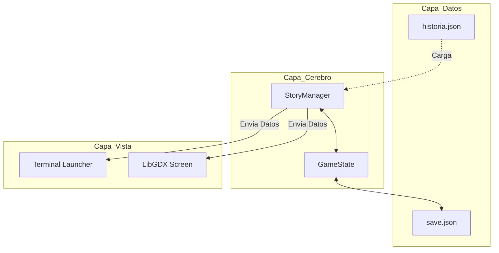
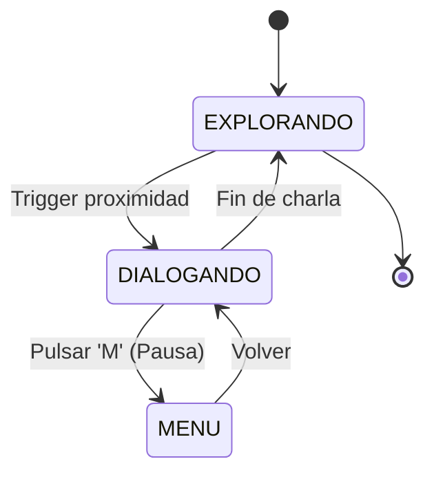
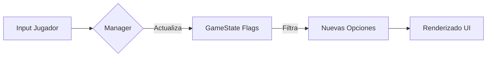

# INTENTIA

> *"Juzgar si la vida vale o no vale la pena vivir es responder a la pregunta fundamental de la filosofía. Considero que el sentido de la vida es la más apremiante de las cuestiones."* — Albert Camus

## Concepto Narrativo

No es solo un juego; **Intentia** es una exploración interactiva sobre el **absurdo** y la **belleza** de la existencia humana. El proyecto invita al jugador a sumergirse en un viaje a través de los ojos de un niño, enfrentándose al asombro y a la duda con la misma curiosidad, en un mundo donde el sentido no se encuentra, sino que se habita.

Esta obra se desarrolla como un **"juego dentro del juego"** donde la realidad es un lienzo neutro y la mirada el pincel. A través del legado del abuelo, el jugador descubre que la narrativa tiene el poder de transformar vapores erráticos en leyendas de dragones, habitando un diálogo entre la ternura y la ironía que convierte lo cotidiano en una oportunidad para trascender su propia visión del mundo.

Se nutre de influencias que van desde la complejidad de *Don Quijote de la Mancha* hasta el *Mito de Sísifo* y el humor cínico de obras como *Bojack Horseman* o *Rick y Morty*. Es un viaje centrado en el poder de la mirada y el peso de lo invisible, una experiencia diseñada para nutrir al jugador con la capacidad de encontrar belleza incluso en el corazón del absurdo.

**el arte de ver formas en las nubes.**

---

## Especificacion del Motor y Arquitectura

El motor de Intentia se basa en el desacoplamiento total entre la logica narrativa y la representacion grafica, permitiendo una escalabilidad modular completa.

### 1. Arquitectura de Capas (MVC)
El sistema separa los datos (JSON), la logica de gestion (StoryManager) y la visualizacion (UI).



### 2. Maquina de Estados de Navegacion
El flujo del usuario se controla mediante estados finitos que determinan la entrada y salida de datos.



### 3. Ciclo de Vida del Dato Narrativo
Como una decision del jugador se convierte en una consecuencia persistente.



---

## Funcionamiento del Sistema

El "corazón" técnico es el `StoryManager`, que actúa como un intérprete de datos (**Data-Driven**). Lee los archivos JSON donde reside la historia y permite seleccionar el idioma al inicio del juego cargando diferentes diccionarios (ej: `es.json`, `en.json`). Gracias a este enfoque, es posible cambiar la historia completa o añadir nuevos capítulos sin necesidad de modificar una sola línea de código.

---

## Instrucciones de Ejecucion

El proyecto utiliza **Gradle** para la gestion de dependencias y construccion.

```bash
# Para ejecutar la demo tecnica por terminal:
./gradlew run
```

---
*Prototipo diseñado bajo estandares de desacoplamiento y persistencia de datos.*
