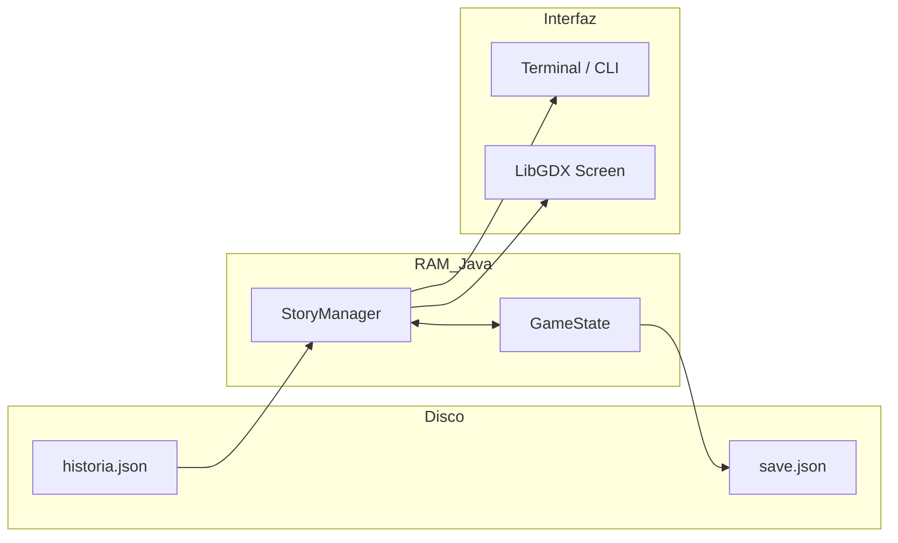
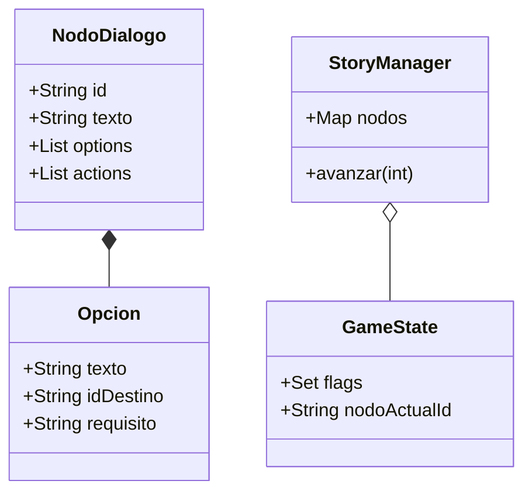
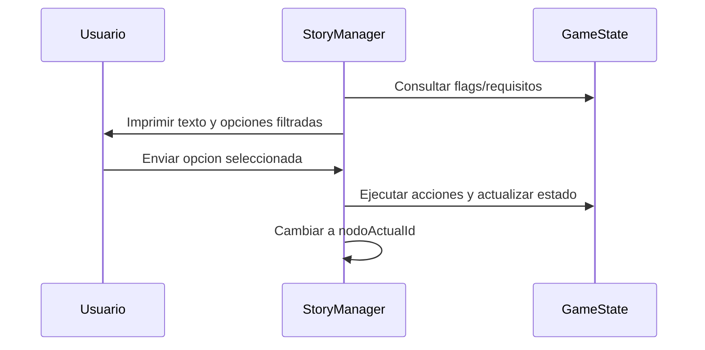
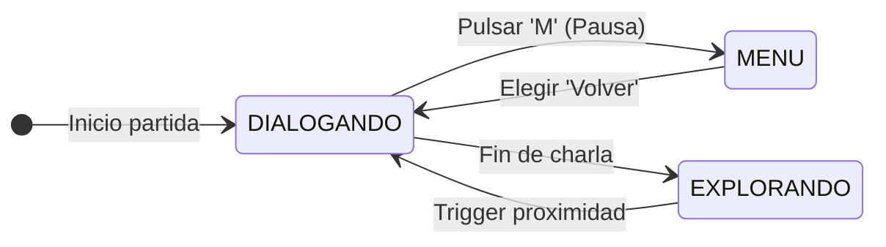
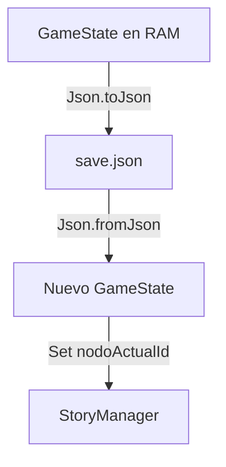

# Especificacion Tecnica: Proyecto Intentia

Documentacion de arquitectura del motor narrativo y sistema de estados.

---

## 1. Arquitectura de Capas
Separacion de responsabilidades entre datos, procesamiento y vista.



---

## 2. Estructura de Clases (Modelos y Logica)
Definicion de las entidades principales y su relacion.



---

## 3. Ciclo de Ejecucion del Turno
Flujo de interaccion desde el input hasta la actualizacion de pantalla.



---

## 4. Gestion de Estados de Interfaz
Control de entrada mediante el patron State (Enum).



---

## 5. Especificacion de Persistencia
Estandar de guardado y carga mediante serealizacion JSON.



---

## 6. Formato de Datos (JSON)
Ejemplo de estructura para historia.json.

```json
[
  {
    "id": "inicio",
    "texto": "Dialogo principal...",
    "opciones": [
      { "texto": "Ir al bosque", "idDestino": "bosque", "requisito": "tiene_brujula" }
    ],
    "actions": ["set_flag:aventura_iniciada"]
  }
]
```

---

## 7. Estandares de Calidad y Rubrica

### Control de Excepciones (Robustez)
- Se define una jerarquia de excepciones (ej: `JuegoException` > `NodoNotFoundException`).
- El motor utiliza bloques `try-catch` especificos para la carga de archivos JSON.
- Se evita el "swallowing" de excepciones, informando siempre al usuario/log.

### Optimizacion de Cadenas (StringBuilder)
- La construccion de menus y pantallas de texto en la terminal se realiza mediante `StringBuilder` para optimizar el uso de memoria en lugar de concatenaciones simples.

### Encapsulamiento y Visibilidad
- Todos los atributos de clase son `private`.
- Se proporcionan metodos `Getter` publicos solo para los campos necesarios.
- Solo se definen `Setters` para campos mutables durante la ejecucion (fomentando la inmutabilidad).

### Gestion de Recursos (IO/NIO)
- La lectura de archivos utiliza el patron `try-with-resources` para garantizar el cierre automatico de flujos de datos.
- Se utiliza la API interna de LibGDX (`Gdx.files`) para una gestion de rutas eficiente.

### Clean Code y Convenciones
- Nomenclatura: `PascalCase` para clases, `camelCase` para metodos y variables.
- Documentacion: Uso de `JavaDoc` en todas las clases y metodos publicos.
