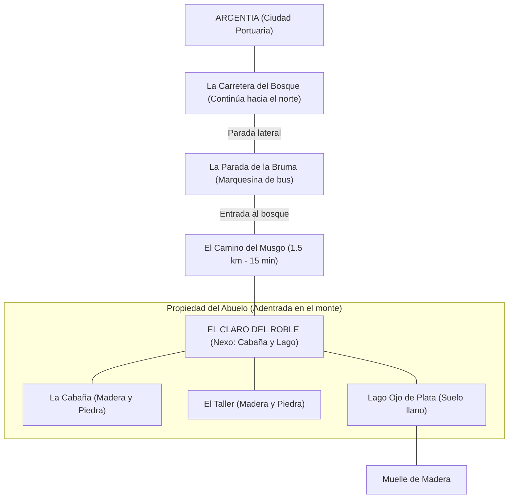

# 🌏 Worldbuilding y Mapas: El Refugio de las Nubes

Este documento define la geografía de *Intentia*, inspirada en la esencia de la Galicia interior (montes, bruma y piedra), pero con nombres y localizaciones originales para el juego.

---

## 🗺️ Mapa Esquemático: De la Costa al Corazón del Monte

---

## 📍 Detalle de Localizaciones (Geografía Interior)

### 1. La Carretera del Bosque
*   **Descripción:** Una carretera estrecha y asfaltada que atraviesa el monte de forma continua. El bosque la rodea por ambos laterales, creando una sensación de aislamiento pero de tránsito.
*   **Lógica:** No es una carretera que termine en la casa del abuelo; sigue hacia delante, conectando con otros puntos del monte que el niño aún no conoce.

### 2. La Parada de la Bruma
*   **Descripción:** Una parada de autobús sencilla situada en el arcén derecho de la carretera. No es más que una pequeña estructura de piedra con un banco.
*   **Punto de Inicio:** Es aquí donde el coche de los padres se detiene, deja al niño y sigue su camino por la carretera. La aventura comienza cruzando la "barrera" de árboles hacia el interior del bosque.

### 3. El Claro del Roble (Entorno Rural)
El abuelo vive en una zona de monte relativamente llana pero **profundamente adentrada en el bosque**, lo que justifica la caminata de 15 minutos desde la parada. El entorno es puramente boscoso y húmedo.

*   **A. La Cabaña:** 
    *   Construida con materiales locales: muros de piedra maciza y **madera oscura** de roble. 
*   **B. El Taller:**
    *   Construcción independiente de **piedra y madera oscura**, situada al lado de la casa.
*   **C. Lago Ojo de Plata:**
    *   Un pequeño lago natural situado **literalmente al lado de las edificaciones**. 
    *   **Muelle:** Un muelle de madera vieja sobre el agua.

### 4. El Reino del Musgo (El Bosque)
*   **Descripción:** Un bosque cerrado de carballos y robles cubiertos de líquenes y musgo. Es una zona de "eterna bruma" donde es fácil perderse... o encontrar dragones.

---

## 📏 Escala y Distancias Reales

Para que el mundo tenga sentido, hemos definido estas distancias basadas en una geografía de monte real:

| Trayecto | Distancia Física | Tiempo | Estado |
| :--- | :--- | :--- | :--- |
| **Argentia -> La Parada** | 35 km | 45 min (Coche) | Carretera de bosque serpenteante. |
| **La Parada -> La Cabaña** | 1.5 km | 15 min (A pie) | Sendero de monte (El Camino del Musgo). |

**Distancia Total Ciudad-Casa:** Aproximadamente **36.5 km**.  
*Aunque no parece mucho en línea recta, la orografía del monte y el estado de la carretera forestal hacen que el abuelo viva "en otro mundo", desconectado del ritmo urbano de Argentia.*

---

## 🎨 Paleta y Atmósfera
*   **Colores:** Gris Ceniza (Piedra), Verde Bosque Profundo, Marrón Tierra y el **Verde Agua (#7FFFD4)** de los detalles del abuelo.
*   **Sensación:** Aislamiento, seguridad, misterio y naturaleza salvaje.
